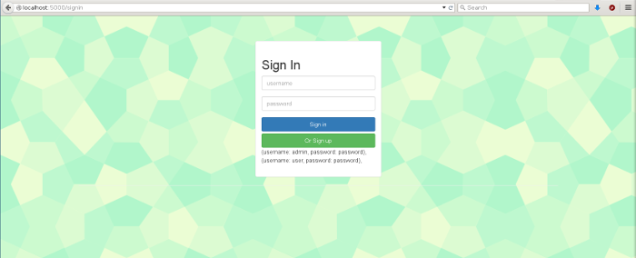
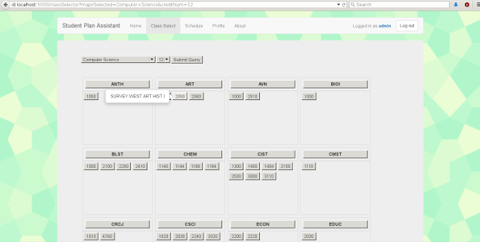
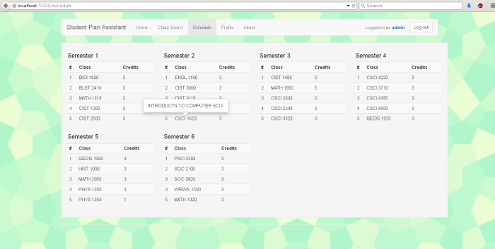

# Student Plan Application

## setup
```bash
virtualenv --no-site-packages -p /usr/bin/python2 env
source env/bin/activate
pip install -r requirements.txt
```

## Running
```bash
python setup.py #sets up database
python server.py #runs server
```
## Screenshots




